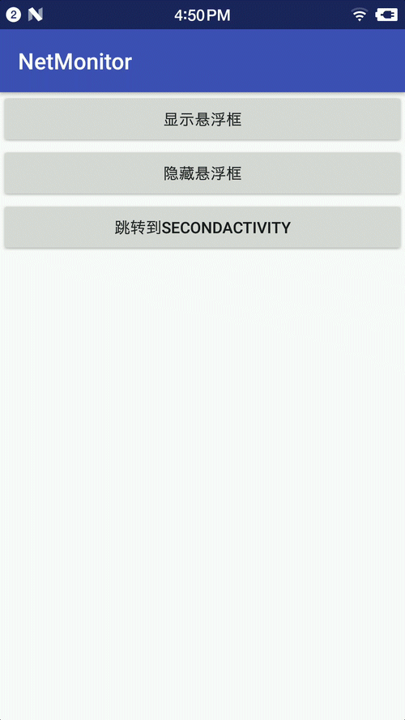

# NetMonitor 

## 效果图

## 特点&关键方法：
    
  + 本悬浮窗NetMonitor**不需要**申请任何权限 (**传统**悬浮窗6.0以下需要申请 android.permission.SYSTEM_ALERT_WINDOW 权限,6.0以上还要在此基础上再加上动态权限判断)
  
  + 在整个应用的入口Application中注册并初始化,PopNetMonitorWindow.initParams(this)
  
  + showNetMonitor(Activity activity) 用来控制悬浮窗的显示
  
  + hindNetMonitor()用来控制悬浮窗的隐藏
  
  + 通过popupWindow.showAtLocation(View parent, int gravity, int x, int y)初始化显示悬浮窗的位置，通过触摸事件的监听+popupwindow.update(int x, int y, int width, int height, boolean force)来更新悬浮窗的当前的位置

   ## 注意：
    
   + 为防止悬浮窗被重复调用，最好使用单例模式。
   
   + 悬浮窗的本质是popupwindow,注意popupwindow的创建时机（页面初始化完毕）。

   ## 创建时机：
    
  + 之前版本会在每个activity中的onResume()中控制显示,onStop()中控制隐藏,因为popupwindow的创建需要在View绘制完毕之后,所以新版本改为在onWindowFocusChanged(boolean hasFocus)中
  控制是否显示问题
  
  
  毕生心血都在这里啦,转载请标明[出处](https://github.com/PrettyAnt/NetMonitor),不胜感激!  
  
 我的[个人博客](https://prettyant.com/)网站,里面总有你喜欢的😏
